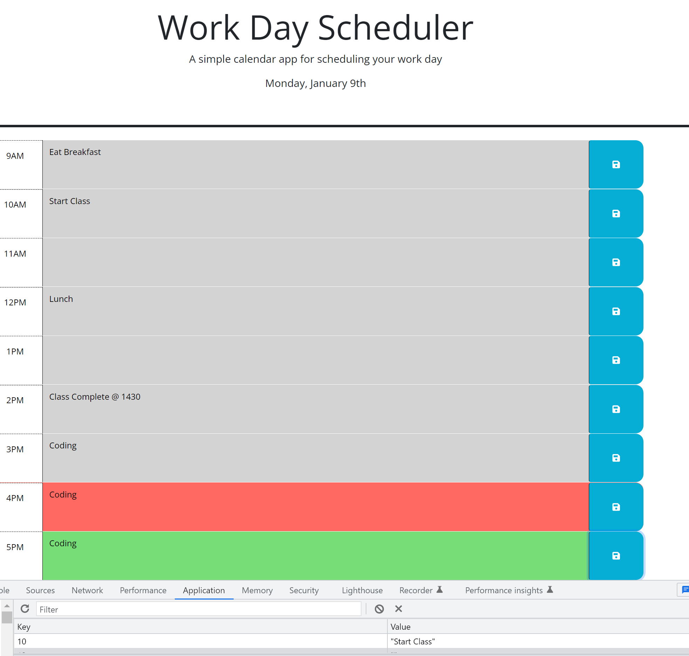

# today-scheduled

## Description

A simple calendar application that allows a user to save events for each hour of the day. This app runs in the browser and features dynamically updated HTML and CSS powered by jQuery. All 

- To help re-inforce foundational coding knowledge I have built a day scheduler web application.
- Overall this project helps individuals keep track of their busy day.
- During this project I traversed the DOM using jQuery. Additionally I worked with event listeners and timing. I also worked with bootstrap to style the page. Finally, local browser storage was used to store and retrieve information.

## Installation

No additional installation is required to deploy this project.

## Usage

Instructions and examples for use including screenshots and github repo/page.

- Click link to view repo: [Github Repo](https://github.com/Git-Vdim-Hub/today-scheduled)
- Click link to view deployed webpage: [Github Pages](https://git-vdim-hub.github.io/today-scheduled/)

- Screenshots

## License

 [MIT](https://choosealicense.com/)

## Tests

Completed Basic Functionality Testing including making sure all buttons work, and correct colors display at all times of the day. Finally after saving text and page is refreshed, text persists. To delete text, clear the text field and press save again.